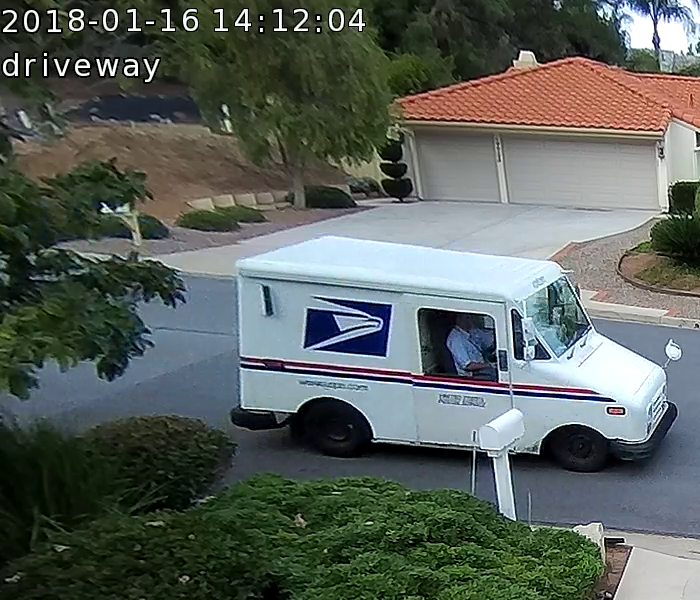
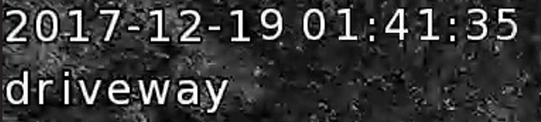
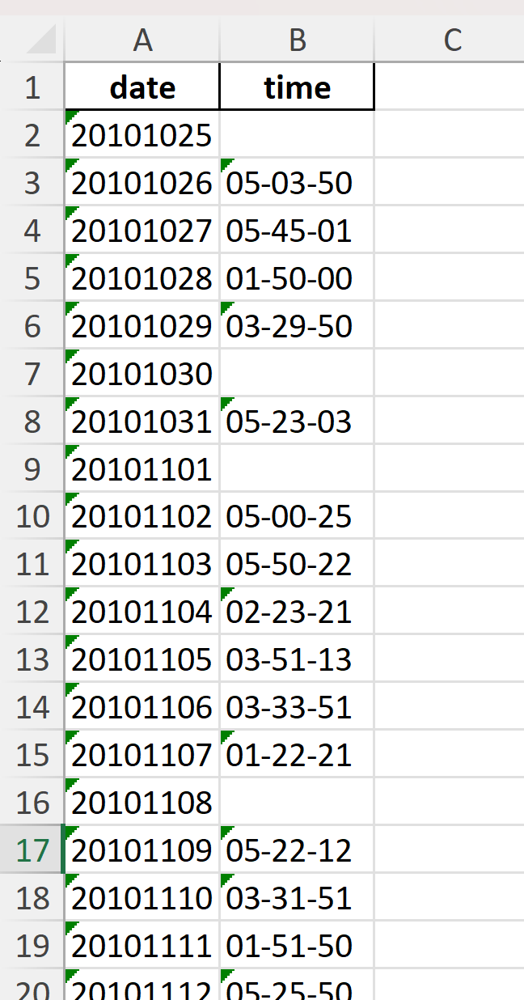

# Mail Delivery Detection

## Overview
I created this project because I wanted to automatically detect when the mail arrived at my mailbox from security camera footage. To accomplish this, I utilized a ResNet18 model pretrained on ImageNet and trained it on my own data. I also trained a TinyVGG model on the MNIST dataset and custom data in order to identify the time stamp on my security camera footage. By the end, the model was able to parse dozens of hours of camera footage under varying light and weather conditions to identify when the mail truck arrived.

## Creation Process
### 1. Reading the Timestamp

Every frame of security camera footage contains a timestamp in the upper left, which I wanted to be able to read. First, I utilized Pytesseract OCR to read the digits. However, this yielded low accuracy due to the noisiness and unique font of the timestamps, with the script often confusing 1s and 2s.
My next solution was to create a TinyVGG model and train it on both the MNIST dataset and custom datasets extracted from my security camera footage, which resulted in much more accurate timestamp readings.

- [read_num.py](scripts/read_num.py): contains functions to read a timestamp, and train and finetune a TinyVGG model to identify digits
- [model_train.py](scripts/model_train.py): contains functions to train and test a given model
- [tinyvgg.py](scripts/tinyvgg.py): contains TinyVGG model architecture, copied from https://poloclub.github.io/cnn-explainer/
### 2. Preparing the training data
Before training a model to classify whether the mail truck appeared in an image or not, I needed to prepare training data. Rather than manually parsing hours of security camera footage for frames that contained a  mail truck, I slightly automated the process by utilizing the YOLOv5 framework to identify frames that contained a truck. This significantly narrowed down the number of frames I had to manually parse and sort.

- [create_training_datasets.py](scripts/create_training_datasets.py): contains a function to save frames of a video containing a truck, utilizing YOLOv5
- [save_frames_from_video.py](scripts/save_frames_from_video.py): contains a function to save every 100 frames of a video, with the filename being the timestamp read by by custom timestamp-reading model
### 3. Training the model

I utilized a ResNet18 model pretrained on ImageNet and finetuned it using my own datasets. Finally, I combined both the timestamp-reading model and mail-identification model to parse through several months of security camera footage and document the time the mail truck arrived every day.

- [identify_mail.py](scripts/identify_mail.py): contains functions to find and save the frames in a video that contain a mail truck
> **Note:** Full datasets not included here to protect my privacy.

## Future Improvements
- Integrate trained model into program to monitor live security camera footage and notify users when the mail has arrived
- Make timestamp reading model more robust by automatically detecting how to segment digits rather than manually segmenting them
